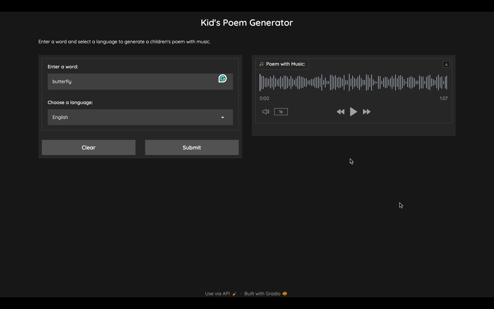

# Kids Poem Generator 🎨📜🎶


Welcome to the **Kids Poem Generator**, an AI-powered application designed to inspire creativity and joy in children through personalized poetry and music. This tool allows kids to generate unique, rhyming poems based on a single word and select their preferred language. The poems are then transformed into engaging audio files, complete with soothing background music, making storytelling fun and interactive.

## 📝 Table of Contents

- [Features](#features)
- [Demo](#demo)
- [Technologies Used](#technologies-used)
- [Installation](#installation)
- [Usage](#usage)
- [Project Structure](#project-structure)
- [Contributing](#contributing)
- [License](#license)
- [Contact](#contact)

## 🎉 Features

- **AI-Powered Poem Generation**: Create unique, rhyming children's poems based on any input word.
- **Multilingual Support**: Generate poems in multiple languages including English, Spanish, French, German, Italian, Chinese, Japanese, and Korean.
- **Text-to-Speech (TTS)**: Convert generated poems into spoken audio using Google's TTS.
- **AI-Generated Music**: Automatically generate background music that complements the poem using Meta's MusicGen model.
- **Audio Combining**: Seamlessly blend the poem's speech audio with the generated music to produce a harmonious final output.
- **User-Friendly Interface**: Interactive web interface built with Gradio, tailored to be engaging and easy for kids to use.

## 🎥 Demo




*Note: Replace the above image with actual screenshots of your application.*

## 🛠 Technologies Used

- **Python 3.8+**
- **OpenAI API**: Leveraging powerful language models for poem generation.
- **LangChain**: Simplifying the integration of language models.
- **Gradio**: Creating an interactive web-based user interface.
- **MusicGen (Facebook)**: Generating background music based on text prompts.
- **gTTS (Google Text-to-Speech)**: Converting text into natural-sounding speech.
- **Pydub**: Manipulating and combining audio files.
- **Scipy**: Handling audio file operations.

## 📦 Installation

### 1. Clone the Repository

```bash
git clone https://github.com/yourusername/kids-poem-generator.git
cd kids-poem-generator
```

### 2. Create a Virtual Environment

It's recommended to use a virtual environment to manage dependencies.

```bash
python3 -m venv .venv
source .venv/bin/activate  # On Windows: .venv\Scripts\activate
```

### 3. Install Dependencies

```bash
pip install -r requirements.txt
```

### 4. Set Up Environment Variables

For security reasons, it's best to store API keys as environment variables.

- **OpenAI API Key**: Obtain your API key from [OpenAI](https://platform.openai.com/account/api-keys).

Set the environment variable in your terminal:

```bash
export OPENAI_API_KEY='your-openai-api-key-here'
```

*On Windows:*

```bash
set OPENAI_API_KEY='your-openai-api-key-here'
```

Alternatively, create a `.env` file in the project root and add:

```env
OPENAI_API_KEY=your-openai-api-key-here
```

*Ensure `.env` is added to `.gitignore` to prevent accidental commits.*

## 🚀 Usage

### Running the Gradio Interface

Execute the following command to launch the web interface:

```bash
python gradio_app.py
```

After running, Gradio will provide a local URL (e.g., `http://127.0.0.1:7860/`). Open this URL in your web browser to access the application.

### Using the Application

1. **Enter a Word**: Input any word that you want the poem to be about.
2. **Select a Language**: Choose your preferred language for the poem.
3. **Generate Poem**: Click the "Generate Poem" button.
4. **Play Audio**: Click the "Play Poem with Music" button to listen to the poem accompanied by background music.
5. **Download Audio**: Optionally, you can download the final audio file for offline listening.

## 📂 Project Structure

```
kids-poem-generator/
├── app.py                   # Core application logic
├── audio_join.py            # Handles audio combining
├── gen_poem.py              # LLM service for poem generation
├── music_gen.py             # Music generation using MusicGen
├── tts.py                   # Text-to-speech service
├── gradio_app.py            # Gradio interface setup
├── requirements.txt         # Python dependencies
├── README.md                # Project documentation
├── assets/
│   ├── kids_poem.png        # Interface image
│   └── demo_screenshot.png  # Demo screenshot
└── final_output.mp3         # Generated audio output
```

## 🤝 Contributing

Contributions are welcome! If you'd like to improve the project, follow these steps:

1. **Fork the Repository**
2. **Create a New Branch**

```bash
git checkout -b feature/YourFeature
```

3. **Commit Your Changes**

```bash
git commit -m "Add feature"
```

4. **Push to the Branch**

```bash
git push origin feature/YourFeature
```

5. **Open a Pull Request**


## 📧 Contact

For any questions or feedback, feel free to reach out:

- **Email**: [Email](shagundeepsingh80@gmail.com)
- **GitHub**: [@axiom19](https://github.com/axiom19)
- **Portfolio**: [website](https://shagunnsingh007.wixsite.com/my-site)
